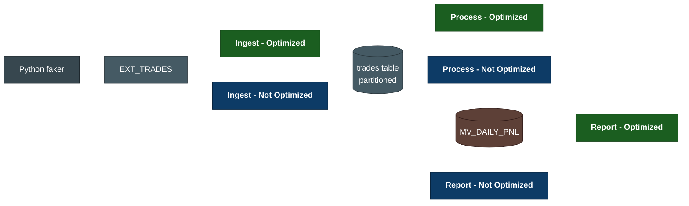

<div align="center">


<br/>

[](https://github.com/Sudeshna-11/quantumsettle/actions/workflows/ci.yml)
[](LICENSE)
[](https://www.oracle.com/database/free/)
[](https://www.python.org/)
[](db/04_optimized)
[](docker-compose.yml)

</div>

---

## 📖 Project Overview

QuantumSettle is a PL/SQL performance showcase on **Oracle Database 23ai Free**.
A trade pipeline runs in three phases — Ingest, Process, Report — and every phase
ships in **two implementations**: *Optimized* and *Not Optimized*. A benchmark
harness runs both, prints the speedup, and an EXPLAIN PLAN report shows *why*
the optimized version wins.

The headline result on a 20,000-trade workload is a **4.9× speedup** on the
Process phase, driven by partition pruning.


<div align="center">



</div>

---

## 🧭 Reading Order

If you're just landing here:

1. **[`docs/flow.md`](docs/flow.md)** — the three-phase pipeline with a
   colour-coded Mermaid diagram and a step-by-step walkthrough.
2. **[`docs/perf-story.md`](docs/perf-story.md)** — auto-generated EXPLAIN
   PLAN comparison. The plans are the evidence; the numbers in the table
   below are the result.
3. **The package headers themselves** — each SQL package opens with a clear
   `Purpose:` / `Overview:` block.

---

## 🎯 Project Requirements

| # | Requirement |
|---|-------------|
| 1 | Ingest trade feeds from CSV into a partitioned Oracle table with row-level error capture |
| 2 | Enrich every trade in bulk with derived columns (`net_amount`, `settlement_date`) |
| 3 | Produce a daily P&L report per account, refreshed incrementally on commit |
| 4 | Ship every phase in two variants — Optimized and Not Optimized — for direct comparison |
| 5 | Provide a benchmark harness that prints timings and captures EXPLAIN PLAN evidence |
| 6 | Surface results in a server-rendered dashboard (Phase comparisons + perf chart) |
| 7 | Run the full stack reproducibly via Docker; CI must pass on every push |

---

## 🏗️ Data Architecture

| Layer | Component | Role |
|-------|-----------|------|
| Source | Python faker | Generates simulated trade CSV feeds |
| Staging | `EXT_TRADES` external table | Reads CSV files in-place from a mounted directory |
| Core | `TRADES` (range-interval partitioned by `trade_date`) | Monthly partitions, auto-created |
| Audit | `BATCH_AUDIT`, `INGEST_ERRORS`, `ERROR_LOG`, `PERF_METRICS` | Run telemetry and observability |
| Aggregate | `MV_DAILY_PNL` (`REFRESH FAST ON COMMIT`, `QUERY REWRITE`) | Pre-aggregated daily P&L |
| Application | FastAPI + Jinja2 + Bootstrap + Chart.js | Server-rendered dashboard |

Deeper rationale lives in [`docs/architecture.md`](docs/architecture.md);
the full pipeline walkthrough is in [`docs/flow.md`](docs/flow.md).

---

## 🛠️ Tools & Technologies

| Category | Choice |
|----------|--------|
| Database | Oracle Database 23ai Free (Docker — `gvenzl/oracle-free:23-slim`) |
| Language | PL/SQL · Python 3.11+ |
| PL/SQL techniques | `BULK COLLECT`, `FORALL`, `SAVE EXCEPTIONS`, partition pruning, materialised views with query rewrite, autonomous transactions |
| DB driver | `python-oracledb` (thin mode — no Oracle Instant Client) |
| Backend | FastAPI |
| Frontend | Jinja2 server-rendered + Bootstrap 5 + Chart.js (CDN) |
| DB testing | utPLSQL-style assertions in plain PL/SQL |
| Python testing | pytest |
| CI / CD | GitHub Actions with an Oracle service container |
| Containers | Docker Compose with a named volume for persistence |

---

## 🚀 Phase Progress

| Phase   | What it shows                                                | Optimization technique                             |
|---------|--------------------------------------------------------------|----------------------------------------------------|
| Phase 1 | Load a staged CSV into a partitioned table                   | `BULK COLLECT` + `FORALL` + `SAVE EXCEPTIONS`      |
| Phase 2 | Derive two columns in bulk for every trade on a date         | Set-based `UPDATE` + **partition pruning**         |
| Phase 3 | Daily P&L per account                                        | Materialized view with query rewrite               |

Each phase has a corresponding *Not Optimized* variant under
[`db/05_not_optimized/`](db/05_not_optimized) that intentionally bypasses the
optimization. Same inputs, same outputs, different cost — that's what makes
the benchmark fair.

---

## 📊 Benchmark Results

20,000 trades across 5 business days, same hardware, same Oracle instance:

| Phase | 🟩 Optimized | 🟦 Not Optimized | Speedup |
|-------|-----------:|----------------:|--------:|
| INGEST  | 2.18 s | 2.85 s  | 1.3× |
| PROCESS | 1.55 s | 7.56 s  | **4.9×** |
| REPORT  | 0.01 s | 0.01 s  | 1.9× |
| **TOTAL** | **3.73 s** | **10.42 s** | **2.8×** |

Reproduce locally:

```bash
python -m quantumsettle.bench.run     --trades 20000 --days 5
python -m quantumsettle.bench.explain   # regenerates docs/perf-story.md
```

The auto-generated [`docs/perf-story.md`](docs/perf-story.md) shows the
side-by-side EXPLAIN PLAN — the planner output is the evidence behind the
numbers above.

---

## ⚙️ Quick Start

```bash
cp .env.example .env                  # fill in strong passwords
docker compose up -d                  # boots Oracle 23ai (first run ~3-4 min)
.\tasks.ps1 wait                      # Windows  (Linux/Mac: make wait)

pip install -e ".[dev]"
python -m quantumsettle.scripts.admin_setup
python -m quantumsettle.scripts.migrate

python -m quantumsettle.faker.run all --days 5 --trades-per-day 1000
python -m quantumsettle.scripts.ingest  load    --variant optimized trades_*.csv
python -m quantumsettle.scripts.process run-all --variant optimized
python -m quantumsettle.scripts.report  pnl     --variant optimized --date 2026-05-12

python -m quantumsettle.bench.run --trades 20000 --days 5
python -m quantumsettle.api.run   --port 8765    # → http://127.0.0.1:8765
```

---

## 📂 Repository Structure

```
db/
├── 00_bootstrap/        Tablespaces + grants (runs once at container init)
├── 01_schema/           Tables, external table, MV log, constraints
├── 02_common/           PKG_OPS, PKG_PERF — shared utilities
├── 03_mviews/           MV_DAILY_PNL
├── 04_optimized/        PKG_INGEST_OPTIMIZED, PKG_PROCESS_OPTIMIZED, PKG_REPORT_OPTIMIZED
├── 05_not_optimized/    Deliberately-slow variants for benchmarking
└── 99_seed/             Reference data (currencies, exchanges)

py/quantumsettle/
├── api/                 FastAPI + Jinja2 dashboard
├── bench/               Timing harness + EXPLAIN PLAN capture
├── faker/               Trade CSV generator + reference seed
└── scripts/             CLI entry points (ingest, process, report, migrate, …)

tests/
├── plsql/               PL/SQL assertion-style unit tests
└── py/                  pytest smoke tests

docs/                    flow.md, architecture.md, perf-story.md, logo.svg
.github/workflows/       ci.yml — full schema build + tests on every push
```

---

## 📚 Documentation

| Document | What's inside |
|----------|---------------|
| [`docs/flow.md`](docs/flow.md) | Three-phase pipeline walkthrough with colour-coded Mermaid diagram |
| [`docs/architecture.md`](docs/architecture.md) | Design rationale: why partitioning, why an MV, why two variants |
| [`docs/perf-story.md`](docs/perf-story.md) | Auto-generated EXPLAIN PLAN comparison (regenerated by `bench.explain`) |

---

## 📄 License

Released under the [MIT License](LICENSE).
